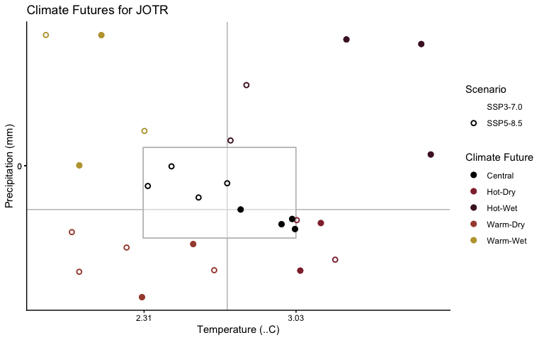
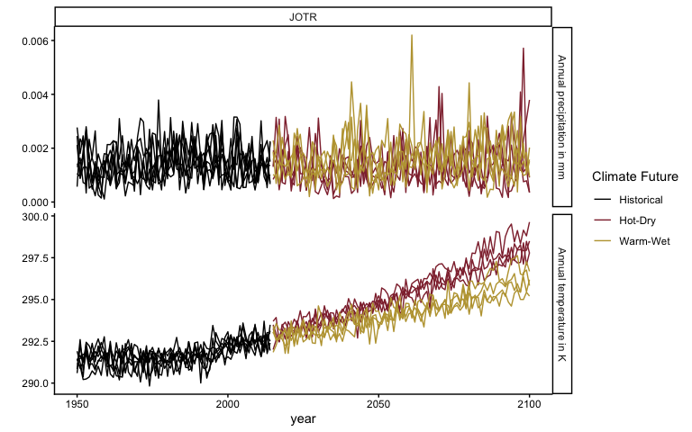
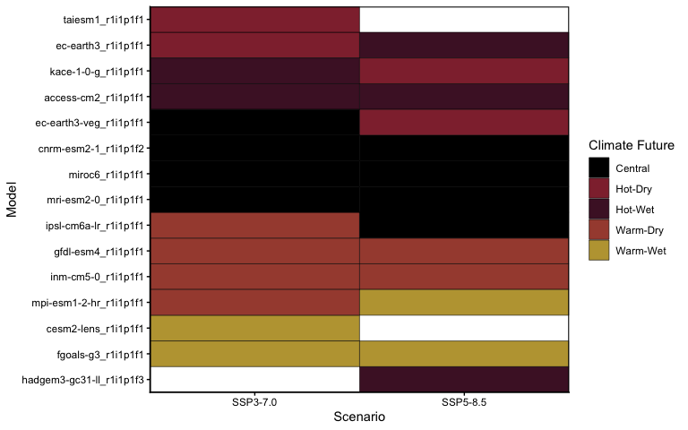
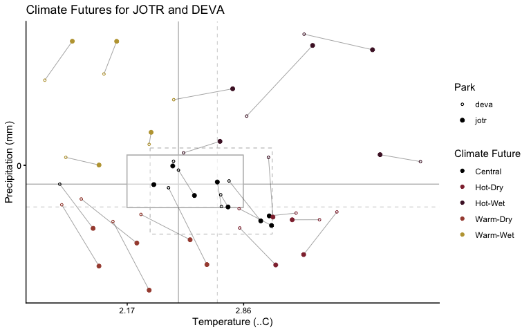
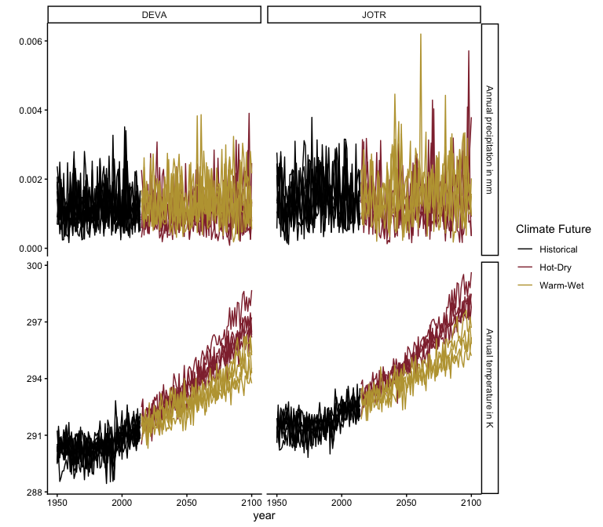

# Climate Futures classification

This notebook executes methods to classify a climate scenario data
ensemble into the National Park Service’s *Climate Futures* framework.
The Climate Futures framework is a storyline approach for climate
scenario planning under uncertainty. It reclassifies a CMIP ensemble of
climate models/scenario combinations into new scenarios, based on their
actual climate impact at a certain location.

``` r
source('visualize.R')
```

``` r
plot_climate_futures('jotr')
```



``` r
plot_climate_futures_ensemble(parks = c('jotr'))
```



- `src` 📁 contains all the functions needed to create the data:

  - `config.py` 📄 defines global variables

  - `dataLoader.py` 📄 is a class with methods to load various data
    sets. So far ISIMIP 3b, and CalAdapt (CMIP6 downscaled with
    LOCA2-hybrid) have been implemented. If you are interested in using
    a different data source, you will need to add a method to the
    `dataLoader()` class

  - `climateFutures.py` 📄 contains all the functions needed to classify
    scenarios and save output. If your `dataLoader()` method is written
    correctly, it should be able to work with any newly added dataset.

- `outputs` 📁 contains classified output files

- `visualize.R` 📄 defines all functions needed for the plots.

## Additional Plots

To check which model/scenario combination got classified into which
climate future run

``` r
plot_model_overview(park = 'jotr')
```



To understand, if two national parks differ in their classification run

``` r
combine_two_parks(parks = c('jotr', 'deva'))
```



To plot time series for multiple parks, run

``` r
plot_climate_futures_ensemble(parks = c('jotr', 'deva'))
```



------------------------------------------------------------------------

This current version assumes that input climate data lives local:

- To download CalAdapt, use `intake_caladapt.ipynb`
- To download ISIMIP 3b, see the `isimip` folder

Note that our classification orientates itself from the original
*Climate Futures* methodology, but does not completely reproduce it.
Important differences:

- Original CF uses MACA-downscaled CMIP5, we use LOCA2-downscaled CMIP6
  for our main applications
- Original CF uses observations as the baseline for anomaly
  calculations, we use historical simulations of the model of questions

More information on the original *Climate Futures* methodology can be
found
[here](https://www.nps.gov/subjects/climatechange/climatefutures.htm).
